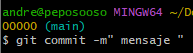

con el comando cd se usa para moverte al directorio donde quieres inicializar el repositorio.
para crear el nuevo directorio para el repositorio se utiliza el comando mkdir.
luego con touch puedes crear un archivo dentro de las carpetas que se creen. 
para inicializar un nuevo repositorio git en el directorio actual se usa el comando git init. 
para verificar el estado del repositorio se usa git status.
para añadir archivos al stage y poder hacerles los commits se usa git add. 
luego para realizar el commit  se usa el comando git commit -m"comentario ".
el .gitignore mantiene el repositorio limpio y ordenado y evita subir archivos innecesarios.

